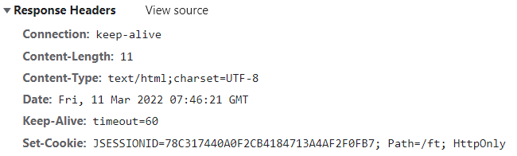

# FTCommunity

## 发送邮件

- 邮箱设置

  - 启用客户端SMTP服务
  - 我这里使用的qq邮箱，设置->账户->POP3/IMAP/SMTP/Exchange/CardDAV/CalDAV服务->开启了POP3/SMTP服务。

- Spring Email

  - 导入jar包

  - ```xml
            <!-- https://mvnrepository.com/artifact/org.springframework.boot/spring-boot-starter-mail -->
            <dependency>
                <groupId>org.springframework.boot</groupId>
                <artifactId>spring-boot-starter-mail</artifactId>
                <version>2.2.6.RELEASE</version>
            </dependency>
    ```

  - 邮箱参数配置

    - ```xml
      # Mailproperties
      # 声明访问的邮箱域名是什么
      spring.mail.host=smtp.qq.com
      # 端口，基本上所有的邮箱，它默认的发送邮件的端口都是465
      spring.mail.port=465
      #邮箱的账号密码
      spring.mail.username=zlh36@qq.com
      
      spring.mail.password=
      # 指定协议
      spring.mail.properties.mail.smtp.auth=true
      spring.mail.properties.mail.smtp.starttls.enable=true
      spring.mail.properties.mail.smtp.starttls.required=true
      spring.mail.properties.mail.smtp.socketFactory.class=javax.net.ssl.SSLSocketFactory
      ```

    - 这个里面的password从邮箱中获得授权码 

  - 使用JavaMailSender发送邮件

    - ```java
      @Component
      public class MailClient {
          private static final Logger logger = LoggerFactory.getLogger(MailClient.class);
      
          @Autowired
          private JavaMailSender mailSender;
      
          @Value("${spring.mail.username}")
          private String from;
      
          public void sendMail(String to , String subject, String content){
              try {
                  MimeMessage message = mailSender.createMimeMessage();
                  MimeMessageHelper helper = new MimeMessageHelper(message);
                  helper.setFrom(from); //设置发送方
                  helper.setTo(to);  //设置接收方
                  helper.setSubject(subject); //设置邮件标题
                  helper.setText(content,true);  //设置邮件内容，true表明允许支持html文本
                  mailSender.send(helper.getMimeMessage());
              } catch (MessagingException e) {
                  logger.error("发送邮件失败："+e.getMessage());
              }
          }
      }
      ```

- 模板引擎

  - 使用Thymeleaf发送Html邮件

## 会话管理

- Http的基本性质

  - Http是简单的
  - Http是可扩展的
  - Http是无状态的，有会话的
    - 在同一个连接中(同一个浏览器访问同一个服务器)，两个执行成功的请求之间是没有关系的。
    - 同一个浏览器向同一个服务器发送多个请求，服务器也不认为这些请求之间有什么联系。即便是来源于同一个浏览器。
    - 而使用Http的头部扩展，HTTP Cookies就可以解决这个问题。把Cookie添加到头部中，创建一个会话让每次请求都能共享相同的上下文信息，达成相同的状态。
    - Http本质是无状态的，使用Cookies可以创建有状态的会话。

- Cookie

  - 是服务器发送到浏览器，并保存在浏览器端的一小块数据

  - 浏览器下次访问该服务器时，会自动携带该块数据，并将其发送给服务器

  - ```java
       /**
         * cookie 示例
         * @param response
         * @return
         */
        @GetMapping("/cookie/set")
        @ResponseBody
        public String SetCookie(HttpServletResponse response){
            //创建cookie
            //cookie没有无参构造器，参数必须都是字符串，并且每个cookie只能存一组字符串，
            Cookie cookie = new Cookie("code", CommunityUtil.generateUUID());
            //设置Cookie生效的范围,有些路径的访问不必要携带cookie。
            cookie.setPath("/ft");
            //设置cookie的生存时间，这个方法的单位是秒
            cookie.setMaxAge(60*10);
            //发送cookie
            response.addCookie(cookie);
            return "set Cookie";
        }
        @GetMapping("/cookie/get")
        @ResponseBody
        public String GetCookie(@CookieValue("code") String code){
            System.out.println(code);
            return "get Cookie";
        }
    }
    ```

- Session

  - 是JavaEE的标准，用于在服务端记录客户端的信息。

  - 数据存放在服务端更加安全，但是也会增加服务端的内存压力。

  -  

  - ```java
        /**
         * session示例
         * session中存放什么数据都行，因为session一直在服务端保存着。
         * 但是cookie中只能存字符串，而且只能存少量数据，因为cookie一直在客户端和服务器之间来回传送。
         * cookie信息不能什么都写，安全问题。数据不能太多，性能问题。
         * @param session
         * @return
         */
        @GetMapping("/session/set")
        @ResponseBody
        public String SetSession(HttpSession session){
            session.setAttribute("name","张三");
            session.setAttribute("age",88);
            return "session set";
        }
    ```

  - 在浏览器访问这个session之后，就会获得一个cookie的response，这个cookie里面存着他的sessionID。这个cookie的生存周期默认是到浏览器关闭。服务器通过这个cookie来判断是不是同一个浏览器。

  -  

