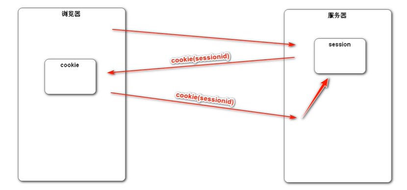
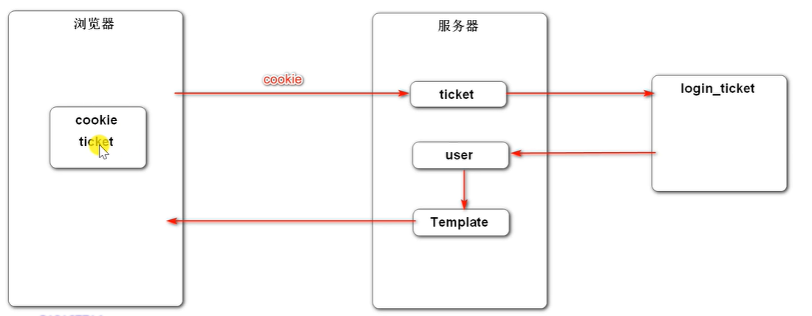
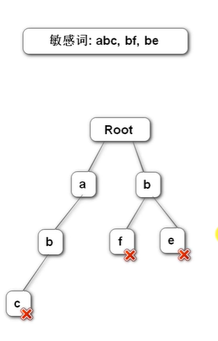

# FTCommunity

## 发送邮件

- 邮箱设置

  - 启用客户端SMTP服务
  - 我这里使用的qq邮箱，设置->账户->POP3/IMAP/SMTP/Exchange/CardDAV/CalDAV服务->开启了POP3/SMTP服务。

- Spring Email

  - 导入jar包

  - ```xml
            <!-- https://mvnrepository.com/artifact/org.springframework.boot/spring-boot-starter-mail -->
            <dependency>
                <groupId>org.springframework.boot</groupId>
                <artifactId>spring-boot-starter-mail</artifactId>
                <version>2.2.6.RELEASE</version>
            </dependency>
    ```

  - 邮箱参数配置

    - ```xml
      # Mailproperties
      # 声明访问的邮箱域名是什么
      spring.mail.host=smtp.qq.com
      # 端口，基本上所有的邮箱，它默认的发送邮件的端口都是465
      spring.mail.port=465
      #邮箱的账号密码
      spring.mail.username=zlh36@qq.com
      
      spring.mail.password=
      # 指定协议
      spring.mail.properties.mail.smtp.auth=true
      spring.mail.properties.mail.smtp.starttls.enable=true
      spring.mail.properties.mail.smtp.starttls.required=true
      spring.mail.properties.mail.smtp.socketFactory.class=javax.net.ssl.SSLSocketFactory
      ```

    - 这个里面的password从邮箱中获得授权码 

  - 使用JavaMailSender发送邮件

    - ```java
      @Component
      public class MailClient {
          private static final Logger logger = LoggerFactory.getLogger(MailClient.class);
      
          @Autowired
          private JavaMailSender mailSender;
      
          @Value("${spring.mail.username}")
          private String from;
      
          public void sendMail(String to , String subject, String content){
              try {
                  MimeMessage message = mailSender.createMimeMessage();
                  MimeMessageHelper helper = new MimeMessageHelper(message);
                  helper.setFrom(from); //设置发送方
                  helper.setTo(to);  //设置接收方
                  helper.setSubject(subject); //设置邮件标题
                  helper.setText(content,true);  //设置邮件内容，true表明允许支持html文本
                  mailSender.send(helper.getMimeMessage());
              } catch (MessagingException e) {
                  logger.error("发送邮件失败："+e.getMessage());
              }
          }
      }
      ```

- 模板引擎

  - 使用Thymeleaf发送Html邮件

## 会话管理

- Http的基本性质

  - Http是简单的
  - Http是可扩展的
  - Http是无状态的，有会话的
    - 在同一个连接中(同一个浏览器访问同一个服务器)，两个执行成功的请求之间是没有关系的。
    - 同一个浏览器向同一个服务器发送多个请求，服务器也不认为这些请求之间有什么联系。即便是来源于同一个浏览器。
    - 而使用Http的头部扩展，HTTP Cookies就可以解决这个问题。把Cookie添加到头部中，创建一个会话让每次请求都能共享相同的上下文信息，达成相同的状态。
    - Http本质是无状态的，使用Cookies可以创建有状态的会话。

- Cookie

  - 是服务器发送到浏览器，并保存在浏览器端的一小块数据

  - 浏览器下次访问该服务器时，会自动携带该块数据，并将其发送给服务器

  - ```java
       /**
         * cookie 示例
         * @param response
         * @return
         */
        @GetMapping("/cookie/set")
        @ResponseBody
        public String SetCookie(HttpServletResponse response){
            //创建cookie
            //cookie没有无参构造器，参数必须都是字符串，并且每个cookie只能存一组字符串，
            Cookie cookie = new Cookie("code", CommunityUtil.generateUUID());
            //设置Cookie生效的范围,有些路径的访问不必要携带cookie。
            cookie.setPath("/ft");
            //设置cookie的生存时间，这个方法的单位是秒
            cookie.setMaxAge(60*10);
            //发送cookie
            response.addCookie(cookie);
            return "set Cookie";
        }
        @GetMapping("/cookie/get")
        @ResponseBody
        public String GetCookie(@CookieValue("code") String code){
            System.out.println(code);
            return "get Cookie";
        }
    }
    ```

- Session

  - 是JavaEE的标准，用于在服务端记录客户端的信息。

  - 数据存放在服务端更加安全，但是也会增加服务端的内存压力。

  -  

  - ```java
        /**
         * session示例
         * session中存放什么数据都行，因为session一直在服务端保存着。
         * 但是cookie中只能存字符串，而且只能存少量数据，因为cookie一直在客户端和服务器之间来回传送。
         * cookie信息不能什么都写，安全问题。数据不能太多，性能问题。
         * @param session
         * @return
         */
        @GetMapping("/session/set")
        @ResponseBody
        public String SetSession(HttpSession session){
            session.setAttribute("name","张三");
            session.setAttribute("age",88);
            return "session set";
        }
    ```

  - 在浏览器访问这个session之后，就会获得一个cookie的response，这个cookie里面存着他的sessionID。这个cookie的生存周期默认是到浏览器关闭。服务器通过这个cookie来判断是不是同一个浏览器。

  -  

## 验证码工具

用现成的工具。

- Kaptcha

  - 导入jar包

  - ```XML
            <!-- https://mvnrepository.com/artifact/com.github.penggle/kaptcha -->
            <dependency>
                <groupId>com.github.penggle</groupId>
                <artifactId>kaptcha</artifactId>
                <version>2.3.2</version>
            </dependency>
    ```

  - 编写kaptcha配置类

    - springboot没有针对他做整合，没有给他做自动配置，我们需要自己对它做一些配置，我们可以写一些配置类，配置好以后，把这个配置类加载到Spring容器里，Spring容器可以对它做一个初始化。

    - ```java
      @Configuration
      public class KaptchaConfig {
          //这个Bean将会被Spring容器所管理，所装配，我们要装配的肯定是这个工具的核心的代码，对象。
          //Kaptcha核心的对象是一个接口，Producer
          @Bean
          public Producer kaptchaProducer(){
              Properties properties = new Properties();
              properties.setProperty("kaptcha.image.width","100");//单位是像素。
              properties.setProperty("kaptcha.image.hight","40");//单位是像素。
              properties.setProperty("kaptcha.textproducer.font.size","32");//字号大小。
              properties.setProperty("kaptcha.textproducer.font.color","0,0,0");//0,0,0表示黑色，直接写单词也可以。
              properties.setProperty("kaptcha.textproducer.char.string","0123456789ABCDEFGHIJKLNMOPQRSTUVWXYZ");//随机字母的范围
              properties.setProperty("kaptcha.textproducer.char.length","4");//随机字母的长度限定
              //要采用哪个干扰类，干扰类的作用就是图片上的点，线，阴影等干扰元素。默认干扰就做的很好所以。
              properties.setProperty("kaptcha.noise.impl","com.google.code.kaptcha.impl.NoNoise");
      
      
              //DefaultKaptcha 是Producer接口默认的实现类。
              DefaultKaptcha defaultKaptcha = new DefaultKaptcha();
              //传入配置，参数，到一个Config对象里面。
              Config config = new Config(properties);
              defaultKaptcha.setConfig(config);
              return defaultKaptcha;
          }
      }
      ```

  - 生成随机字符，图片。

    - ```java
       /**
           * 生成验证码
           * @param session
           * @param response
           */
          @GetMapping("/kaptcha")
          public void getKaptcha(HttpSession session, HttpServletResponse response){
              //生成验证码
              String text = kaptchaProduce.createText();
              //生成图片
              BufferedImage image = kaptchaProduce.createImage(text);
        
              //验证码存入session，好在后面的请求中验证验证码是否正确
              session.setAttribute("code",text);
              //将图片输出给浏览器，人工的输出。
              response.setContentType("image/png");//声明浏览器返回什么样的数据
        
              try {
                  //获取response的输出流，这个输出流整个由springMVC维护管理
                  ServletOutputStream outputStream = response.getOutputStream();
                  //向浏览器输出图片的工具。(图片，格式，使用的输出流)
                  ImageIO.write(image,"png",outputStream);
              } catch (IOException e) {
                  logger.error("响应验证码失败："+e.getMessage());
              }
          }
      ```

  - 附代一个html中的code代码编写，单击事件更换验证码

    - ```html
      
      ```

    - ```js
      $(function () {
      			$("#code_img").click(function () {
      				//在事件响应的function函数中有一个this对象，这个this对象，是当前正在响应时间的Dom对象。
      				//src属性表示验证码img标签的 图片路径，他可读，可写。
      				this.src = CONTEXT_PATH+"/kaptcha?d="+Math.random();
      			});
      		});
      ```

## 拦截登录信息

- 拦截器示例

  - 定义拦截器，实现HandlerInterceptor

    - ```java
      @Component
      public class DemoInterceptor implements HandlerInterceptor {
          //首先声明@Component 交给Spring容器去管理
          //实现HandlerInterceptor，拦截器的接口
          //接口里面有preHandle，postHandle，afterCompletion，三种方法，但是都是default类型的，默认实现的，所以想实现哪个就实现哪个就好。
          // Ogject handler 是拦截的目标 比如说拦截路径 /login  那这个就是/login对应的方法。
      
          private static final Logger logger = LoggerFactory.getLogger(DemoInterceptor.class);
      
          //在Controller之前执行。
          @Override
          public boolean preHandle(HttpServletRequest request, HttpServletResponse response, Object handler) throws Exception {
              logger.debug("preHandle："+ handler.toString());
              //如果return false  方法就不会往下执行，Cotroller就不会被执行。
              return true;
          }
      
          //在调用完Controller之后执行的
          @Override
          public void postHandle(HttpServletRequest request, HttpServletResponse response, Object handler, ModelAndView modelAndView) throws Exception {
              logger.debug("postHandle:"+handler.toString());
          }
      
          //在模板引擎（TemplateEngine）执行之后执行
          @Override
          public void afterCompletion(HttpServletRequest request, HttpServletResponse response, Object handler, Exception ex) throws Exception {
              logger.debug("afterCompletion:"+handler.toString());
          }
      }
      ```

  - 配置拦截器，为它指定拦截排除的路径

    - ```java
      @Configuration
      public class WebConfig implements WebMvcConfigurer {
          @Autowired
          private DemoInterceptor demoInterceptor;
      
          @Override
          public void addInterceptors(InterceptorRegistry registry) {
              //添加拦截器，如果不做配置的话就会拦截一切请求
              // 路径 /**/*.css   第一个/指的时访问路径，http://localhost:8888/工程路径/
              // 也可以理解/**指的是static下面的所有文件。
              //excludePathPatterns() 不拦截的路径
              //addPathPatterns 拦截的路径。
              registry.addInterceptor(demoInterceptor)
                      .excludePathPatterns("/**/*.css","/**/*.js","/**/*.png","/**/*.jpg","/**/*.jpeg")
                      .addPathPatterns("/register","/login");
          }
      }
      ```

- 拦截器应用

  -  

  - 在请求开始时，查询登录用户

  - 在本次请求中持有用户数据。

  - 在模板视图上显示用户数据。

  - 在请求结束时清理用户数据。

  - 登录信息拦截器实现：

    - ```java
      @Component
      public class LoginInterceptor implements HandlerInterceptor {
          @Autowired
          private UserServiceImpl userService;
          @Autowired
          private HostHolder hostHolder;
          @Override
          public boolean preHandle(HttpServletRequest request, HttpServletResponse response, Object handler) throws Exception {
              String ticket = CookieUtil.getValue(request, "ticket");
              if(ticket != null){
                  //查询凭证
                  LoginTicket loginTicket = userService.findLoginTicket(ticket);
                  //检查凭证是否有效
                  if(loginTicket != null && loginTicket.getStatus() == 0 && loginTicket.getExpired().after(new Date())){
                      //根据凭证查询用户
                      User user = userService.findUserById(loginTicket.getUserId());
                      //在本次请求中持有用户。考虑这个持有的时候要考虑到多线程的情况，每个请求对应一个线程，每个线程单独存一份，不会互相干扰。
                      hostHolder.setUser(user);
                  }
              }
              return true;
          }
      
          @Override
          public void postHandle(HttpServletRequest request, HttpServletResponse response, Object handler, ModelAndView modelAndView) throws Exception {
              User user = hostHolder.getUser();
              if(user != null || modelAndView != null){
                  modelAndView.addObject("loginUser",user);
              }
          }
      
          @Override
          public void afterCompletion(HttpServletRequest request, HttpServletResponse response, Object handler, Exception ex) throws Exception {
              hostHolder.clear();
          }
      }
      ```

  - 持有用户，线程隔离实现：

    - ```java
      /**
       * 持有用户的信息，用于代替session对象的。如果是session的话，可以直接持有用户信息，并且是线程隔离的。
       * 这个是用这个类，体验隔离的实现。
       * @author zrulin
       * @create 2022-03-13 9:35
       */
      @Component
      public class HostHolder {
          private ThreadLocal<User> users = new ThreadLocal<>();
          /**ThreadLocal源码解析
           * set()方法，存值
           *     public void set(T value) {
           *         Thread t = Thread.currentThread();  获取当前线程。
           *         ThreadLocalMap map = getMap(t);    根据当前线程去获取一个map对象
           *         if (map != null)                   然后把值存到线程里面。
           *             map.set(this, value);          存是通过线程来存的，每个线程得到的map对象不一样。
           *         else
           *             createMap(t, value);
           *     }
           *
           * get()方法：取值
           *  public T get() {
           *         Thread t = Thread.currentThread();               获取当前线程
           *         ThreadLocalMap map = getMap(t);                  通过当前线程获取一个map对象。
           *         if (map != null) {                               然后再取值
           *             ThreadLocalMap.Entry e = map.getEntry(this);
           *             if (e != null) {
           *                 @SuppressWarnings("unchecked")
           *                 T result = (T)e.value;
           *                 return result;
           *             }
           *         }
           *         return setInitialValue();
           *     }
           */
      
          public void setUser(User user){
              users.set(user);
          }
          public User getUser(){
              return users.get();
          }
          public void clear(){
              users.remove();
          }
      }
      ```

  - 将拦截器配置到Configuration

    - ```java
      @Configuration
      public class WebConfig implements WebMvcConfigurer {
          @Autowired
          private DemoInterceptor demoInterceptor;
      
          @Autowired
          private LoginInterceptor loginInterceptor;
      
          @Override
          public void addInterceptors(InterceptorRegistry registry) {
              //添加拦截器，如果不做配置的话就会拦截一切请求
              // 路径 /**/*.css   第一个/指的时访问路径，http://localhost:8888/工程路径/
              // 也可以理解/**指的是static下面的所有文件。
              //excludePathPatterns() 不拦截的路径
              //addPathPatterns 拦截的路径。
              registry.addInterceptor(demoInterceptor)
                      .excludePathPatterns("/**/*.css","/**/*.js","/**/*.png","/**/*.jpg","/**/*.jpeg")
                      .addPathPatterns("/register","/login");
      
              registry.addInterceptor(loginInterceptor)
                      .excludePathPatterns("/**/*.css","/**/*.js","/**/*.png","/**/*.jpg","/**/*.jpeg");
          }
      }
      ```

  - html部分判断是否登录的代码：

    - ```html
      <li class="nav-item ml-3 btn-group-vertical">
         <a class="nav-link" th:href="@{/index}">首页</a>
      </li>
      <li class="nav-item ml-3 btn-group-vertical" th:if="${loginUser!=null}">
         <a class="nav-link position-relative" href="site/letter.html">消息<span class="badge badge-danger">12</span></a>
      </li>
      <li class="nav-item ml-3 btn-group-vertical" th:if="${loginUser==null}">
         <a class="nav-link" th:href="@{/register}">注册</a>
      </li>
      <li class="nav-item ml-3 btn-group-vertical" th:if="${loginUser==null}">
         <a class="nav-link" th:href="@{/login}">登录</a>
      </li>
      <li class="nav-item ml-3 btn-group-vertical dropdown" th:if="${loginUser!=null}">
         <a class="nav-link dropdown-toggle" href="#" id="navbarDropdown" role="button" data-toggle="dropdown" aria-haspopup="true" aria-expanded="false">
            
         </a>
         <div class="dropdown-menu" aria-labelledby="navbarDropdown">
            <a class="dropdown-item text-center" href="site/profile.html">个人主页</a>
            <a class="dropdown-item text-center" href="site/setting.html">账号设置</a>
            <a class="dropdown-item text-center" th:href="@{/logout}">退出登录</a>
            <div class="dropdown-divider"></div>
            <span class="dropdown-item text-center text-secondary" th:utext="${loginUser.username}">nowcoder</span>
         </div>
      </li>
      ```


## 文件的上传配置

- 上传文件

  - 上传头像

  - ```java
        @Value("${community.path.upload}")
        private String photoPath;
    
        @Value("${community.path.domain}")
        private String domain;
    
        @Value("${server.servlet.context-path}")
        private String contextPath;
    ```

  - ```xml
    community.path.upload=e:/ideaProjects1/FTCommunity/src/main/resources/static/image/userphoto
    server.servlet.context-path=/ft
    community.path.domain=http://localhost:8080
    ```

  - 将头像存储路径和访问的域名以及工程路径都写在配置文件中便于迁移。

  - 下面是上传头像时的controller

    - ```java
       @PostMapping("/headerImage")
          public String updateHeaderUrl(MultipartFile headImage, Model model){
              if(headImage == null){
                  model.addAttribute("error","您还没有选择图片");
                  return"site/setting";
              }
              //获取图片的名字
              String filename = headImage.getOriginalFilename();
              //获取图片的后缀
              String suffix = filename.substring(filename.lastIndexOf("."));
              if(StringUtils.isBlank(suffix)){
                  model.addAttribute("error","文件的格式不正确");
                  return"site/setting";
              }
              //生成随机文件名
              filename = CommunityUtil.generateUUID() + suffix;
              //确定文件存放的位置
              File dest = new File(photoPath+"/"+filename);
              try {
                  //存储文件
                  headImage.transferTo(dest);
              } catch (IOException e) {
                  logger.error("上传文件失败："+e.getMessage());
                  throw new RuntimeException("上传文件失败，服务器发生异常",e);
              }
              //更新当前用户的头像路径。（web访问路径）
              //http://localhost:8080/工程路径/
              User user = hostHolder.getUser();
              String headerUrl = domain + contextPath + "/user/header/"+filename;
              userService.updateHeaderUrl(user.getId(),headerUrl);
              return "redirect:/index";
          }
      ```

    - 下面时访问头像时的controller

    - ```java
          @GetMapping("/header/{filename}")
          public void getHeader(@PathVariable("filename") String filename,
                                HttpServletResponse response){
              //服务器存取路径
              filename = photoPath +"/"+ filename;
              //获取图片类型
              String type = filename.substring(filename.lastIndexOf("."));
              response.setContentType("image/"+type);
              try (   //读取文件得到输入流
                      ServletOutputStream outputStream = response.getOutputStream();
                      //得到输出流
                      FileInputStream fileInputStream = new FileInputStream(filename);
                      ){
                  //，输出的时候不要一个一个字节的输出，要建立一个缓冲区，比如一次输出1024个字节，一批一批输出，效率高一点
                  byte[] buffer = new byte[1024];
                  int b = 0; //建立游标,不等于-1就是读到数据，等于就是没读到
                  while((b = fileInputStream.read(buffer)) != -1){
                      outputStream.write(buffer,0,b);
                  }
              } catch (IOException e) {
                 logger.error("读取头像失败："+e.getMessage());
              }
          }
      ```

  - 下面时上传文件的配置

    - ```xml
      # multipart
      # 文件上传属性配置
      # 单个文件上传最大大小
      spring.servlet.multipart.max-file-size=10MB
      # 整个上传的文静请求不超过100MB
      spring.servlet.multipart.max-request-size=100MB
      ```


## 自定义注解

- 常用元注解
  - @Target
    - 用来声明我自定义的注解可以写在哪个位置，可以作用在哪些类型上。
  - @Retention
    - 用来声明自定义注解保存的时间，有效时间，你是编译时有效，还是运行时有效。
  - @Document
    - 用来声明自定义注解在生成文档的时候，要不要把这个注解带上去。
  - @Inherited
    - 用于继承，一个子类继承父类， 父类上有这个自定义注解，子类要不要把这个注解也继承下来。
- 通过反射，在程序运行的时候读取到这个注解。

配置自定义注解：

```java
/**
 * @author zrulin
 * @create 2022-03-13 17:55
 */
@Target(ElementType.METHOD)
@Retention(RetentionPolicy.RUNTIME)
public @interface LoginRequired {

}
```

在需要拦截的路径上面加上这个我的自定义注解，

然后配置拦截器：

```java
@Component
public class LoginRequireInterceptor implements HandlerInterceptor {
    @Autowired
    private HostHolder hostHolder;
    @Override
    public boolean preHandle(HttpServletRequest request, HttpServletResponse response, Object handler) throws Exception {
        if(handler instanceof HandlerMethod){
            HandlerMethod handlerMethod = (HandlerMethod) handler;
            Method method = handlerMethod.getMethod();
            LoginRequired annotation = method.getAnnotation(LoginRequired.class);
            if(annotation != null && hostHolder.getUser() == null){
                response.sendRedirect(request.getContextPath()+"/login");
                return false;
            }
        }
        return true;
    }
}
```

然后将拦截器加入配置中

## 过滤敏感词

- 前缀树
  - 名称：Trie,字典树，查找树
  - 特点：查找效率高，消耗内存大。
  - 应用：字符串检索，瓷瓶统计，字符串排序等
    - 前缀树的根节点不包含任何字符。
    - 除了根节点以外的节点只包含一个字符
    - 从根节点到某一个节点，经过的路径上每个节点的字符连接起来，对应的字符串。
    -  
- 铭感词过滤器
  - 定义前缀树：关键代码：
  
    - ```java
      //定义一个内部类，作为前缀树的结构
      private static class TrieNode{
          //关键词结束的标识
          private boolean isKeyWordEnd = false;
          //子节点(key 代表下级的节点字符， value是下级节点)
          private Map<Character, TrieNode> subNode = new HashMap<>();
      
          public boolean isKeyWordEnd() {
              return isKeyWordEnd;
          }
      
          public void setKeyWordEnd(boolean keyWordEnd) {
              isKeyWordEnd = keyWordEnd;
          }
      
          //添加子节点
          public void addSubNode(Character key,TrieNode subNode){
              this.subNode.put(key,subNode);
          }
          //获取子节点
          public TrieNode getSubNode(Character key){
              return subNode.get(key);
          }
      }
      ```
  
  - 根据敏感词，初始化前缀树。
  
    - 这里把铭感词写入了.txt的文件所以读取铭感词需要从磁盘中读：(关键代码)
  
    - ```java
      // @PostConstruct 表明这是一个初始化方法，在类被实例化的时候就执行。
      @PostConstruct
      public void init(){
          // 获取类加载器，类加载器是从类路径下，去加载资源，所谓的类路径就是target/classes/目录之下。
          // 我们的程序一编译，所有的程序都编译到classes下，包括配置文件。
          try(
                  //得到字节流
                  InputStream is = this.getClass().getClassLoader().getResourceAsStream("sensitive-words.txt");
                  //从字节流中读文字不太方便，把字节流转成字符流，把字符流改成缓冲流会效率更高
                  BufferedReader reader = new BufferedReader(new InputStreamReader(is));
          ){
              String keyword;  //用这个keyword去读数据
              while((keyword = reader.readLine()) != null){//一行一行的读
                  //添加到前缀树
                  this.addKeyWord(keyword);
              }
          }catch (IOException e){
              logger.error("获取铭感词文件失败："+e.getMessage());
          }
      }
      //把一个敏感词添加到前缀树中去。
      public void addKeyWord(String keyword){
          TrieNode tempNode = rootNode;
          for(int i = 0 ; i< keyword.length() ; ++i){
              char key = keyword.charAt(i);
              //找子节点
              TrieNode subNode = tempNode.getSubNode(key);
              if(subNode == null){//如果没有这个子节点
                  //初始化子节点；
                  subNode = new TrieNode();
                  tempNode.addSubNode(key,subNode);
              }
              //指向子节点，进入下一次循环
              tempNode = subNode;
              if(i == keyword.length() -1){
                  tempNode.setKeyWordEnd(true);
              }
          }
      }
      ```
  
      
  
  - 编写过滤铭感词的方法。用三个指针来完成：
  
    - （关键代码）
  
    - ```java
      /**
           * 过滤敏感词
           * @param text 待过滤的文本
           * @return    过滤后的文本
           */
          public String filter(String text){
              if(StringUtils.isBlank(text)){
                  return null;
              }
              //指针1 ，指向树
              TrieNode tempNode = rootNode;
              //指针2 指向字符串的慢指针，一直往前走
              int begin = 0;
              //指针3 指向字符串的快指针，往后走检查，如果不是就归位。
              int position = 0;
              //结果
              StringBuilder result = new StringBuilder();
              while(position < text.length()){
                  char c = text.charAt(position);
                  //跳过符号
                  if(isSymbol(c)){
                      //若指针处于根节点。则将此符号计入结果，让指针向下走一步。
                      if(tempNode == rootNode){
                          result.append(c);
                          begin++;
                      }
                      //无论结构在开头或中间指针3都向下走一步。
                      position++;
                      continue;
                  }
                  tempNode = tempNode.getSubNode(c);
                  if(tempNode == null){
      //                以begin为开头的字符串不存在敏感词
                      result.append(text.charAt(begin));
                      //进入下一个位置
                      position = ++begin;
                      // 重新指向根节点。
                      tempNode  = rootNode;
                  }else if(tempNode.isKeyWordEnd()){
                      //发现了敏感词,将begin-posttion中的字符串替换
                      result.append(REPLACEMENT);
      //                进入下一个位置。
                      begin = ++ position;
                      tempNode = rootNode;
                  }else{
                      //检查下一个字符
                      position++;
                  }
              }
              //将最后一批字符计入结构
              result.append(text.substring(begin));
              return result.toString();
          }
      
          //判断是否为符号,是的话返回true，不是的话返回false
          public boolean isSymbol(Character c){
              //!CharUtils.isAsciiAlphanumeric(c)判断合法字符
              //c < 0x2E80 || c > 0x9fff 东亚文字的范围是0x2E80到0x9fff
              return !CharUtils.isAsciiAlphanumeric(c) && (c < 0x2E80 || c > 0x9fff);
          }
      ```

## 异步请求Ajax

- Asynchronous JavaScript and XML
- 异步的JavaScript和XML，不是一门新技术，只是一个新的术语。
- 使用Ajax，网页能够将增量更新呈现在页面上，而不需要刷新整个页面。
- 虽然X代表XML，但目前JSON的使用比XML更加普遍

在项目中使用fastjson的jar包来处理json数据。

```xml
<!-- https://mvnrepository.com/artifact/com.alibaba/fastjson -->
<dependency>
    <groupId>com.alibaba</groupId>
    <artifactId>fastjson</artifactId>
    <version>1.2.75</version>
</dependency>
```

封装返回json对象方法：

```java
/**
 * 获取返回的json对象
 * @param code  状态编码
 * @param msg   提示信息
 * @param map   业务数据
 * @return
 */
public static String getJsonString(int code, String msg, Map<String,Object> map){
    JSONObject json = new JSONObject();
    json.put("code",code);
    json.put("msg",msg);
    if(map != null){
        for(String key : map.keySet()){
            json.put(key,map.get(key));
        }
    }
    return json.toJSONString();
}
public static String getJsonString(int code, String msg){
   return getJsonString(code,msg,null);
}
public static String getJsonString(int code){
   return getJsonString(code,null,null);
}
```

```js
//部分js代码:
//发送异步请求
$.post(
   CONTEXT_PATH+"/discuss/add",
   {"title":title,"content":content},
   function(data){
      data = $.parseJSON(data);
      //在提示框中显示返回消息
      $("#hintBody").text(data.msg);
      //显示提示框
      $("#hintModal").modal("show");
      //2秒后，自动隐藏提示框
      setTimeout(function(){
         $("#hintModal").modal("hide");
         //刷新页面
         if(data.code == 200){
            window.location.reload();
         }
      }, 2000);
   }
);
```

