# FTCommunity

==**Partners**==   -  寻找最合适你的搭档

## 发送邮件

- 邮箱设置

  - 启用客户端SMTP服务
  - 我这里使用的qq邮箱，设置->账户->POP3/IMAP/SMTP/Exchange/CardDAV/CalDAV服务->开启了POP3/SMTP服务。

- Spring Email

  - 导入jar包

  - ```xml
            <!-- https://mvnrepository.com/artifact/org.springframework.boot/spring-boot-starter-mail -->
            <dependency>
                <groupId>org.springframework.boot</groupId>
                <artifactId>spring-boot-starter-mail</artifactId>
                <version>2.2.6.RELEASE</version>
            </dependency>
    ```

  - 邮箱参数配置

    - ```xml
      # Mailproperties
      # 声明访问的邮箱域名是什么
      spring.mail.host=smtp.qq.com
      # 端口，基本上所有的邮箱，它默认的发送邮件的端口都是465
      spring.mail.port=465
      #邮箱的账号密码
      spring.mail.username=zlh36@qq.com
      
      spring.mail.password=
      # 指定协议
      spring.mail.properties.mail.smtp.auth=true
      spring.mail.properties.mail.smtp.starttls.enable=true
      spring.mail.properties.mail.smtp.starttls.required=true
      spring.mail.properties.mail.smtp.socketFactory.class=javax.net.ssl.SSLSocketFactory
      ```

    - 这个里面的password从邮箱中获得授权码 

  - 使用JavaMailSender发送邮件

    - ```java
      @Component
      public class MailClient {
          private static final Logger logger = LoggerFactory.getLogger(MailClient.class);
      
          @Autowired
          private JavaMailSender mailSender;
      
          @Value("${spring.mail.username}")
          private String from;
      
          public void sendMail(String to , String subject, String content){
              try {
                  MimeMessage message = mailSender.createMimeMessage();
                  MimeMessageHelper helper = new MimeMessageHelper(message);
                  helper.setFrom(from); //设置发送方
                  helper.setTo(to);  //设置接收方
                  helper.setSubject(subject); //设置邮件标题
                  helper.setText(content,true);  //设置邮件内容，true表明允许支持html文本
                  mailSender.send(helper.getMimeMessage());
              } catch (MessagingException e) {
                  logger.error("发送邮件失败："+e.getMessage());
              }
          }
      }
      ```

- 模板引擎

  - 使用Thymeleaf发送Html邮件

## 会话管理

- Http的基本性质

  - Http是简单的
  - Http是可扩展的
  - Http是无状态的，有会话的
    - 在同一个连接中(同一个浏览器访问同一个服务器)，两个执行成功的请求之间是没有关系的。
    - 同一个浏览器向同一个服务器发送多个请求，服务器也不认为这些请求之间有什么联系。即便是来源于同一个浏览器。
    - 而使用Http的头部扩展，HTTP Cookies就可以解决这个问题。把Cookie添加到头部中，创建一个会话让每次请求都能共享相同的上下文信息，达成相同的状态。
    - Http本质是无状态的，使用Cookies可以创建有状态的会话。

- Cookie

  - 是服务器发送到浏览器，并保存在浏览器端的一小块数据

  - 浏览器下次访问该服务器时，会自动携带该块数据，并将其发送给服务器

  - ```java
       /**
         * cookie 示例
         * @param response
         * @return
         */
        @GetMapping("/cookie/set")
        @ResponseBody
        public String SetCookie(HttpServletResponse response){
            //创建cookie
            //cookie没有无参构造器，参数必须都是字符串，并且每个cookie只能存一组字符串，
            Cookie cookie = new Cookie("code", CommunityUtil.generateUUID());
            //设置Cookie生效的范围,有些路径的访问不必要携带cookie。
            cookie.setPath("/ft");
            //设置cookie的生存时间，这个方法的单位是秒
            cookie.setMaxAge(60*10);
            //发送cookie
            response.addCookie(cookie);
            return "set Cookie";
        }
        @GetMapping("/cookie/get")
        @ResponseBody
        public String GetCookie(@CookieValue("code") String code){
            System.out.println(code);
            return "get Cookie";
        }
    }
    ```

- Session

  - 是JavaEE的标准，用于在服务端记录客户端的信息。

  - 数据存放在服务端更加安全，但是也会增加服务端的内存压力。

  - 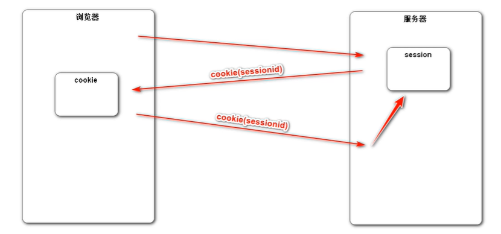 

  - ```java
        /**
         * session示例
         * session中存放什么数据都行，因为session一直在服务端保存着。
         * 但是cookie中只能存字符串，而且只能存少量数据，因为cookie一直在客户端和服务器之间来回传送。
         * cookie信息不能什么都写，安全问题。数据不能太多，性能问题。
         * @param session
         * @return
         */
        @GetMapping("/session/set")
        @ResponseBody
        public String SetSession(HttpSession session){
            session.setAttribute("name","张三");
            session.setAttribute("age",88);
            return "session set";
        }
    ```

  - 在浏览器访问这个session之后，就会获得一个cookie的response，这个cookie里面存着他的sessionID。这个cookie的生存周期默认是到浏览器关闭。服务器通过这个cookie来判断是不是同一个浏览器。

  - 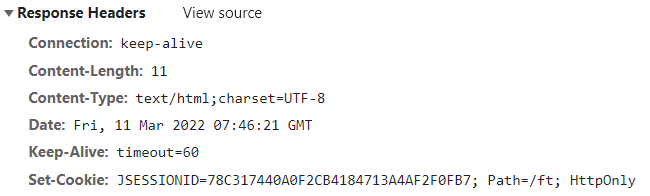 

## 验证码工具

用现成的工具。

- Kaptcha

  - 导入jar包

  - ```XML
            <!-- https://mvnrepository.com/artifact/com.github.penggle/kaptcha -->
            <dependency>
                <groupId>com.github.penggle</groupId>
                <artifactId>kaptcha</artifactId>
                <version>2.3.2</version>
            </dependency>
    ```

  - 编写kaptcha配置类

    - springboot没有针对他做整合，没有给他做自动配置，我们需要自己对它做一些配置，我们可以写一些配置类，配置好以后，把这个配置类加载到Spring容器里，Spring容器可以对它做一个初始化。

    - ```java
      @Configuration
      public class KaptchaConfig {
          //这个Bean将会被Spring容器所管理，所装配，我们要装配的肯定是这个工具的核心的代码，对象。
          //Kaptcha核心的对象是一个接口，Producer
          @Bean
          public Producer kaptchaProducer(){
              Properties properties = new Properties();
              properties.setProperty("kaptcha.image.width","100");//单位是像素。
              properties.setProperty("kaptcha.image.hight","40");//单位是像素。
              properties.setProperty("kaptcha.textproducer.font.size","32");//字号大小。
              properties.setProperty("kaptcha.textproducer.font.color","0,0,0");//0,0,0表示黑色，直接写单词也可以。
              properties.setProperty("kaptcha.textproducer.char.string","0123456789ABCDEFGHIJKLNMOPQRSTUVWXYZ");//随机字母的范围
              properties.setProperty("kaptcha.textproducer.char.length","4");//随机字母的长度限定
              //要采用哪个干扰类，干扰类的作用就是图片上的点，线，阴影等干扰元素。默认干扰就做的很好所以。
              properties.setProperty("kaptcha.noise.impl","com.google.code.kaptcha.impl.NoNoise");
      
      
              //DefaultKaptcha 是Producer接口默认的实现类。
              DefaultKaptcha defaultKaptcha = new DefaultKaptcha();
              //传入配置，参数，到一个Config对象里面。
              Config config = new Config(properties);
              defaultKaptcha.setConfig(config);
              return defaultKaptcha;
          }
      }
      ```

  - 生成随机字符，图片。

    - ```java
       /**
           * 生成验证码
           * @param session
           * @param response
           */
          @GetMapping("/kaptcha")
          public void getKaptcha(HttpSession session, HttpServletResponse response){
              //生成验证码
              String text = kaptchaProduce.createText();
              //生成图片
              BufferedImage image = kaptchaProduce.createImage(text);
        
              //验证码存入session，好在后面的请求中验证验证码是否正确
              session.setAttribute("code",text);
              //将图片输出给浏览器，人工的输出。
              response.setContentType("image/png");//声明浏览器返回什么样的数据
        
              try {
                  //获取response的输出流，这个输出流整个由springMVC维护管理
                  ServletOutputStream outputStream = response.getOutputStream();
                  //向浏览器输出图片的工具。(图片，格式，使用的输出流)
                  ImageIO.write(image,"png",outputStream);
              } catch (IOException e) {
                  logger.error("响应验证码失败："+e.getMessage());
              }
          }
      ```

  - 附代一个html中的code代码编写，单击事件更换验证码

    - ```html
      
      ```

    - ```js
      $(function () {
      			$("#code_img").click(function () {
      				//在事件响应的function函数中有一个this对象，这个this对象，是当前正在响应时间的Dom对象。
      				//src属性表示验证码img标签的 图片路径，他可读，可写。
      				this.src = CONTEXT_PATH+"/kaptcha?d="+Math.random();
      			});
      		});
      ```

## 拦截登录信息

- 拦截器示例

  - 定义拦截器，实现HandlerInterceptor

    - ```java
      @Component
      public class DemoInterceptor implements HandlerInterceptor {
          //首先声明@Component 交给Spring容器去管理
          //实现HandlerInterceptor，拦截器的接口
          //接口里面有preHandle，postHandle，afterCompletion，三种方法，但是都是default类型的，默认实现的，所以想实现哪个就实现哪个就好。
          // Ogject handler 是拦截的目标 比如说拦截路径 /login  那这个就是/login对应的方法。
      
          private static final Logger logger = LoggerFactory.getLogger(DemoInterceptor.class);
      
          //在Controller之前执行。
          @Override
          public boolean preHandle(HttpServletRequest request, HttpServletResponse response, Object handler) throws Exception {
              logger.debug("preHandle："+ handler.toString());
              //如果return false  方法就不会往下执行，Cotroller就不会被执行。
              return true;
          }
      
          //在调用完Controller之后执行的
          @Override
          public void postHandle(HttpServletRequest request, HttpServletResponse response, Object handler, ModelAndView modelAndView) throws Exception {
              logger.debug("postHandle:"+handler.toString());
          }
      
          //在模板引擎（TemplateEngine）执行之后执行
          @Override
          public void afterCompletion(HttpServletRequest request, HttpServletResponse response, Object handler, Exception ex) throws Exception {
              logger.debug("afterCompletion:"+handler.toString());
          }
      }
      ```

  - 配置拦截器，为它指定拦截排除的路径

    - ```java
      @Configuration
      public class WebConfig implements WebMvcConfigurer {
          @Autowired
          private DemoInterceptor demoInterceptor;
      
          @Override
          public void addInterceptors(InterceptorRegistry registry) {
              //添加拦截器，如果不做配置的话就会拦截一切请求
              // 路径 /**/*.css   第一个/指的时访问路径，http://localhost:8888/工程路径/
              // 也可以理解/**指的是static下面的所有文件。
              //excludePathPatterns() 不拦截的路径
              //addPathPatterns 拦截的路径。
              registry.addInterceptor(demoInterceptor)
                      .excludePathPatterns("/**/*.css","/**/*.js","/**/*.png","/**/*.jpg","/**/*.jpeg")
                      .addPathPatterns("/register","/login");
          }
      }
      ```

- 拦截器应用

  - 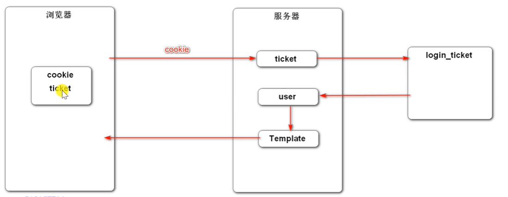 

  - 在请求开始时，查询登录用户

  - 在本次请求中持有用户数据。

  - 在模板视图上显示用户数据。

  - 在请求结束时清理用户数据。

  - 登录信息拦截器实现：

    - ```java
      @Component
      public class LoginInterceptor implements HandlerInterceptor {
          @Autowired
          private UserServiceImpl userService;
          @Autowired
          private HostHolder hostHolder;
          @Override
          public boolean preHandle(HttpServletRequest request, HttpServletResponse response, Object handler) throws Exception {
              String ticket = CookieUtil.getValue(request, "ticket");
              if(ticket != null){
                  //查询凭证
                  LoginTicket loginTicket = userService.findLoginTicket(ticket);
                  //检查凭证是否有效
                  if(loginTicket != null && loginTicket.getStatus() == 0 && loginTicket.getExpired().after(new Date())){
                      //根据凭证查询用户
                      User user = userService.findUserById(loginTicket.getUserId());
                      //在本次请求中持有用户。考虑这个持有的时候要考虑到多线程的情况，每个请求对应一个线程，每个线程单独存一份，不会互相干扰。
                      hostHolder.setUser(user);
                  }
              }
              return true;
          }
      
          @Override
          public void postHandle(HttpServletRequest request, HttpServletResponse response, Object handler, ModelAndView modelAndView) throws Exception {
              User user = hostHolder.getUser();
              if(user != null || modelAndView != null){
                  modelAndView.addObject("loginUser",user);
              }
          }
      
          @Override
          public void afterCompletion(HttpServletRequest request, HttpServletResponse response, Object handler, Exception ex) throws Exception {
              hostHolder.clear();
          }
      }
      ```

  - 持有用户，线程隔离实现：

    - ```java
      /**
       * 持有用户的信息，用于代替session对象的。如果是session的话，可以直接持有用户信息，并且是线程隔离的。
       * 这个是用这个类，体验隔离的实现。
       * @author zrulin
       * @create 2022-03-13 9:35
       */
      @Component
      public class HostHolder {
          private ThreadLocal<User> users = new ThreadLocal<>();
          /**ThreadLocal源码解析
           * set()方法，存值
           *     public void set(T value) {
           *         Thread t = Thread.currentThread();  获取当前线程。
           *         ThreadLocalMap map = getMap(t);    根据当前线程去获取一个map对象
           *         if (map != null)                   然后把值存到线程里面。
           *             map.set(this, value);          存是通过线程来存的，每个线程得到的map对象不一样。
           *         else
           *             createMap(t, value);
           *     }
           *
           * get()方法：取值
           *  public T get() {
           *         Thread t = Thread.currentThread();               获取当前线程
           *         ThreadLocalMap map = getMap(t);                  通过当前线程获取一个map对象。
           *         if (map != null) {                               然后再取值
           *             ThreadLocalMap.Entry e = map.getEntry(this);
           *             if (e != null) {
           *                 @SuppressWarnings("unchecked")
           *                 T result = (T)e.value;
           *                 return result;
           *             }
           *         }
           *         return setInitialValue();
           *     }
           */
      
          public void setUser(User user){
              users.set(user);
          }
          public User getUser(){
              return users.get();
          }
          public void clear(){
              users.remove();
          }
      }
      ```

  - 将拦截器配置到Configuration

    - ```java
      @Configuration
      public class WebConfig implements WebMvcConfigurer {
          @Autowired
          private DemoInterceptor demoInterceptor;
      
          @Autowired
          private LoginInterceptor loginInterceptor;
      
          @Override
          public void addInterceptors(InterceptorRegistry registry) {
              //添加拦截器，如果不做配置的话就会拦截一切请求
              // 路径 /**/*.css   第一个/指的时访问路径，http://localhost:8888/工程路径/
              // 也可以理解/**指的是static下面的所有文件。
              //excludePathPatterns() 不拦截的路径
              //addPathPatterns 拦截的路径。
              registry.addInterceptor(demoInterceptor)
                      .excludePathPatterns("/**/*.css","/**/*.js","/**/*.png","/**/*.jpg","/**/*.jpeg")
                      .addPathPatterns("/register","/login");
      
              registry.addInterceptor(loginInterceptor)
                      .excludePathPatterns("/**/*.css","/**/*.js","/**/*.png","/**/*.jpg","/**/*.jpeg");
          }
      }
      ```

  - html部分判断是否登录的代码：

    - ```html
      <li class="nav-item ml-3 btn-group-vertical">
         <a class="nav-link" th:href="@{/index}">首页</a>
      </li>
      <li class="nav-item ml-3 btn-group-vertical" th:if="${loginUser!=null}">
         <a class="nav-link position-relative" href="site/letter.html">消息<span class="badge badge-danger">12</span></a>
      </li>
      <li class="nav-item ml-3 btn-group-vertical" th:if="${loginUser==null}">
         <a class="nav-link" th:href="@{/register}">注册</a>
      </li>
      <li class="nav-item ml-3 btn-group-vertical" th:if="${loginUser==null}">
         <a class="nav-link" th:href="@{/login}">登录</a>
      </li>
      <li class="nav-item ml-3 btn-group-vertical dropdown" th:if="${loginUser!=null}">
         <a class="nav-link dropdown-toggle" href="#" id="navbarDropdown" role="button" data-toggle="dropdown" aria-haspopup="true" aria-expanded="false">
            
         </a>
         <div class="dropdown-menu" aria-labelledby="navbarDropdown">
            <a class="dropdown-item text-center" href="site/profile.html">个人主页</a>
            <a class="dropdown-item text-center" href="site/setting.html">账号设置</a>
            <a class="dropdown-item text-center" th:href="@{/logout}">退出登录</a>
            <div class="dropdown-divider"></div>
            <span class="dropdown-item text-center text-secondary" th:utext="${loginUser.username}">nowcoder</span>
         </div>
      </li>
      ```


## 文件的上传配置

- 上传文件

  - 上传头像

  - ```java
        @Value("${community.path.upload}")
        private String photoPath;
    
        @Value("${community.path.domain}")
        private String domain;
    
        @Value("${server.servlet.context-path}")
        private String contextPath;
    ```

  - ```xml
    community.path.upload=e:/ideaProjects1/FTCommunity/src/main/resources/static/image/userphoto
    server.servlet.context-path=/ft
    community.path.domain=http://localhost:8080
    ```

  - 将头像存储路径和访问的域名以及工程路径都写在配置文件中便于迁移。

  - 下面是上传头像时的controller

    - ```java
       @PostMapping("/headerImage")
          public String updateHeaderUrl(MultipartFile headImage, Model model){
              if(headImage == null){
                  model.addAttribute("error","您还没有选择图片");
                  return"site/setting";
              }
              //获取图片的名字
              String filename = headImage.getOriginalFilename();
              //获取图片的后缀
              String suffix = filename.substring(filename.lastIndexOf("."));
              if(StringUtils.isBlank(suffix)){
                  model.addAttribute("error","文件的格式不正确");
                  return"site/setting";
              }
              //生成随机文件名
              filename = CommunityUtil.generateUUID() + suffix;
              //确定文件存放的位置
              File dest = new File(photoPath+"/"+filename);
              try {
                  //存储文件
                  headImage.transferTo(dest);
              } catch (IOException e) {
                  logger.error("上传文件失败："+e.getMessage());
                  throw new RuntimeException("上传文件失败，服务器发生异常",e);
              }
              //更新当前用户的头像路径。（web访问路径）
              //http://localhost:8080/工程路径/
              User user = hostHolder.getUser();
              String headerUrl = domain + contextPath + "/user/header/"+filename;
              userService.updateHeaderUrl(user.getId(),headerUrl);
              return "redirect:/index";
          }
      ```

    - 下面时访问头像时的controller

    - ```java
          @GetMapping("/header/{filename}")
          public void getHeader(@PathVariable("filename") String filename,
                                HttpServletResponse response){
              //服务器存取路径
              filename = photoPath +"/"+ filename;
              //获取图片类型
              String type = filename.substring(filename.lastIndexOf("."));
              response.setContentType("image/"+type);
              try (   //读取文件得到输入流
                      ServletOutputStream outputStream = response.getOutputStream();
                      //得到输出流
                      FileInputStream fileInputStream = new FileInputStream(filename);
                      ){
                  //，输出的时候不要一个一个字节的输出，要建立一个缓冲区，比如一次输出1024个字节，一批一批输出，效率高一点
                  byte[] buffer = new byte[1024];
                  int b = 0; //建立游标,不等于-1就是读到数据，等于就是没读到
                  while((b = fileInputStream.read(buffer)) != -1){
                      outputStream.write(buffer,0,b);
                  }
              } catch (IOException e) {
                 logger.error("读取头像失败："+e.getMessage());
              }
          }
      ```

  - 下面时上传文件的配置

    - ```xml
      # multipart
      # 文件上传属性配置
      # 单个文件上传最大大小
      spring.servlet.multipart.max-file-size=10MB
      # 整个上传的文静请求不超过100MB
      spring.servlet.multipart.max-request-size=100MB
      ```


## 自定义注解

- 常用元注解
  - @Target
    - 用来声明我自定义的注解可以写在哪个位置，可以作用在哪些类型上。
  - @Retention
    - 用来声明自定义注解保存的时间，有效时间，你是编译时有效，还是运行时有效。
  - @Document
    - 用来声明自定义注解在生成文档的时候，要不要把这个注解带上去。
  - @Inherited
    - 用于继承，一个子类继承父类， 父类上有这个自定义注解，子类要不要把这个注解也继承下来。
- 通过反射，在程序运行的时候读取到这个注解。

配置自定义注解：

```java
/**
 * @author zrulin
 * @create 2022-03-13 17:55
 */
@Target(ElementType.METHOD)
@Retention(RetentionPolicy.RUNTIME)
public @interface LoginRequired {

}
```

在需要拦截的路径上面加上这个我的自定义注解，

然后配置拦截器：

```java
@Component
public class LoginRequireInterceptor implements HandlerInterceptor {
    @Autowired
    private HostHolder hostHolder;
    @Override
    public boolean preHandle(HttpServletRequest request, HttpServletResponse response, Object handler) throws Exception {
        if(handler instanceof HandlerMethod){
            HandlerMethod handlerMethod = (HandlerMethod) handler;
            Method method = handlerMethod.getMethod();
            LoginRequired annotation = method.getAnnotation(LoginRequired.class);
            if(annotation != null && hostHolder.getUser() == null){
                response.sendRedirect(request.getContextPath()+"/login");
                return false;
            }
        }
        return true;
    }
}
```

然后将拦截器加入配置中

## 过滤敏感词

- 前缀树
  - 名称：Trie,字典树，查找树
  - 特点：查找效率高，消耗内存大。
  - 应用：字符串检索，瓷瓶统计，字符串排序等
    - 前缀树的根节点不包含任何字符。
    - 除了根节点以外的节点只包含一个字符
    - 从根节点到某一个节点，经过的路径上每个节点的字符连接起来，对应的字符串。
    - 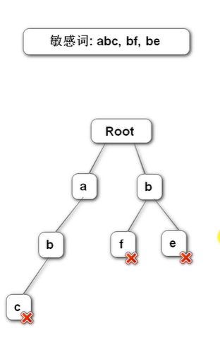 
- 铭感词过滤器
  - 定义前缀树：关键代码：
  
    - ```java
      //定义一个内部类，作为前缀树的结构
      private static class TrieNode{
          //关键词结束的标识
          private boolean isKeyWordEnd = false;
          //子节点(key 代表下级的节点字符， value是下级节点)
          private Map<Character, TrieNode> subNode = new HashMap<>();
      
          public boolean isKeyWordEnd() {
              return isKeyWordEnd;
          }
      
          public void setKeyWordEnd(boolean keyWordEnd) {
              isKeyWordEnd = keyWordEnd;
          }
      
          //添加子节点
          public void addSubNode(Character key,TrieNode subNode){
              this.subNode.put(key,subNode);
          }
          //获取子节点
          public TrieNode getSubNode(Character key){
              return subNode.get(key);
          }
      }
      ```
  
  - 根据敏感词，初始化前缀树。
  
    - 这里把铭感词写入了.txt的文件所以读取铭感词需要从磁盘中读：(关键代码)
  
    - ```java
      // @PostConstruct 表明这是一个初始化方法，在类被实例化的时候就执行。
      @PostConstruct
      public void init(){
          // 获取类加载器，类加载器是从类路径下，去加载资源，所谓的类路径就是target/classes/目录之下。
          // 我们的程序一编译，所有的程序都编译到classes下，包括配置文件。
          try(
                  //得到字节流
                  InputStream is = this.getClass().getClassLoader().getResourceAsStream("sensitive-words.txt");
                  //从字节流中读文字不太方便，把字节流转成字符流，把字符流改成缓冲流会效率更高
                  BufferedReader reader = new BufferedReader(new InputStreamReader(is));
          ){
              String keyword;  //用这个keyword去读数据
              while((keyword = reader.readLine()) != null){//一行一行的读
                  //添加到前缀树
                  this.addKeyWord(keyword);
              }
          }catch (IOException e){
              logger.error("获取铭感词文件失败："+e.getMessage());
          }
      }
      //把一个敏感词添加到前缀树中去。
      public void addKeyWord(String keyword){
          TrieNode tempNode = rootNode;
          for(int i = 0 ; i< keyword.length() ; ++i){
              char key = keyword.charAt(i);
              //找子节点
              TrieNode subNode = tempNode.getSubNode(key);
              if(subNode == null){//如果没有这个子节点
                  //初始化子节点；
                  subNode = new TrieNode();
                  tempNode.addSubNode(key,subNode);
              }
              //指向子节点，进入下一次循环
              tempNode = subNode;
              if(i == keyword.length() -1){
                  tempNode.setKeyWordEnd(true);
              }
          }
      }
      ```
  
      
  
  - 编写过滤铭感词的方法。用三个指针来完成：
  
    - （关键代码）
  
    - ```java
      /**
           * 过滤敏感词
           * @param text 待过滤的文本
           * @return    过滤后的文本
           */
          public String filter(String text){
              if(StringUtils.isBlank(text)){
                  return null;
              }
              //指针1 ，指向树
              TrieNode tempNode = rootNode;
              //指针2 指向字符串的慢指针，一直往前走
              int begin = 0;
              //指针3 指向字符串的快指针，往后走检查，如果不是就归位。
              int position = 0;
              //结果
              StringBuilder result = new StringBuilder();
              while(position < text.length()){
                  char c = text.charAt(position);
                  //跳过符号
                  if(isSymbol(c)){
                      //若指针处于根节点。则将此符号计入结果，让指针向下走一步。
                      if(tempNode == rootNode){
                          result.append(c);
                          begin++;
                      }
                      //无论结构在开头或中间指针3都向下走一步。
                      position++;
                      continue;
                  }
                  tempNode = tempNode.getSubNode(c);
                  if(tempNode == null){
      //                以begin为开头的字符串不存在敏感词
                      result.append(text.charAt(begin));
                      //进入下一个位置
                      position = ++begin;
                      // 重新指向根节点。
                      tempNode  = rootNode;
                  }else if(tempNode.isKeyWordEnd()){
                      //发现了敏感词,将begin-posttion中的字符串替换
                      result.append(REPLACEMENT);
      //                进入下一个位置。
                      begin = ++ position;
                      tempNode = rootNode;
                  }else{
                      //检查下一个字符
                      position++;
                  }
              }
              //将最后一批字符计入结构
              result.append(text.substring(begin));
              return result.toString();
          }
      
          //判断是否为符号,是的话返回true，不是的话返回false
          public boolean isSymbol(Character c){
              //!CharUtils.isAsciiAlphanumeric(c)判断合法字符
              //c < 0x2E80 || c > 0x9fff 东亚文字的范围是0x2E80到0x9fff
              return !CharUtils.isAsciiAlphanumeric(c) && (c < 0x2E80 || c > 0x9fff);
          }
      ```

## 异步请求Ajax

- Asynchronous JavaScript and XML
- 异步的JavaScript和XML，不是一门新技术，只是一个新的术语。
- 使用Ajax，网页能够将增量更新呈现在页面上，而不需要刷新整个页面。
- 虽然X代表XML，但目前JSON的使用比XML更加普遍

在项目中使用fastjson的jar包来处理json数据。

```xml
<!-- https://mvnrepository.com/artifact/com.alibaba/fastjson -->
<dependency>
    <groupId>com.alibaba</groupId>
    <artifactId>fastjson</artifactId>
    <version>1.2.75</version>
</dependency>
```

封装返回json对象方法：

```java
/**
 * 获取返回的json对象
 * @param code  状态编码
 * @param msg   提示信息
 * @param map   业务数据
 * @return
 */
public static String getJsonString(int code, String msg, Map<String,Object> map){
    JSONObject json = new JSONObject();
    json.put("code",code);
    json.put("msg",msg);
    if(map != null){
        for(String key : map.keySet()){
            json.put(key,map.get(key));
        }
    }
    return json.toJSONString();
}
public static String getJsonString(int code, String msg){
   return getJsonString(code,msg,null);
}
public static String getJsonString(int code){
   return getJsonString(code,null,null);
}
```

```js
//部分js代码:
//发送异步请求
$.post(
   CONTEXT_PATH+"/discuss/add",
   {"title":title,"content":content},
   function(data){
      data = $.parseJSON(data);
      //在提示框中显示返回消息
      $("#hintBody").text(data.msg);
      //显示提示框
      $("#hintModal").modal("show");
      //2秒后，自动隐藏提示框
      setTimeout(function(){
         $("#hintModal").modal("hide");
         //刷新页面
         if(data.code == 200){
            window.location.reload();
         }
      }, 2000);
   }
);
```

## Spring事务管理

什么是事务？

- 事务是由N步数据库操作序列组成的逻辑单元，这些列操作要么全执行，要么全放弃执行。	

事务的特性（ACID）

- 原子性：事务应用中不可再分的最小执行体。
- 一致性：事务执行的结果，须使数据从一个一致性状态，变成另一个一致性状态。
- 隔离性：各个事务执行互不干扰，任何事务的内部操作对其他事务都是隔离的。
- 持久性：事务一旦提交，对数据所作的任何改变都要记录到永久存储器中。

事务的隔离性：

- 常见的并发异常：
  - 第一类丢失更新，第二类丢失更新（两种更新问题）
    - 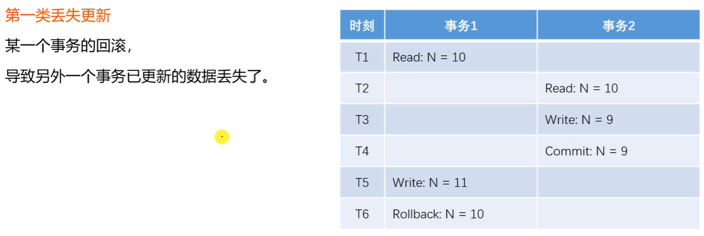 
    -  
  - 脏读，不可重复读，幻读。
    - 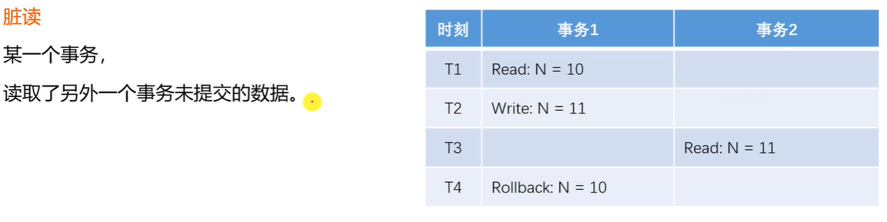 
    - 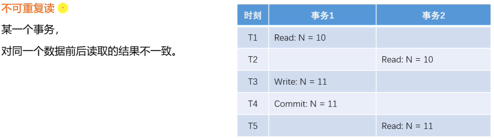 
    - 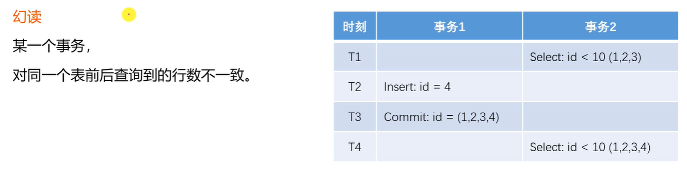 
    - 
- 常见的隔离级别
  - Read UnCommitted ：读取未提交的数据
  - Read Committed   ：读取已提交的数据
  - Repeatable Read ：可重复读
  - Serializable ：串行化
  - 不同的隔离级别有不同的问题：
  - 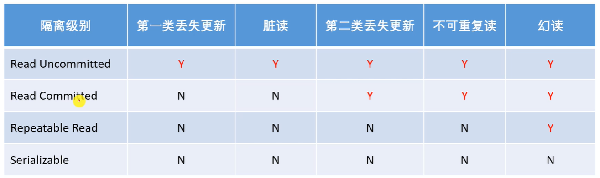 
- 实现机制
  - 悲观锁（数据库）
    - 共享锁（S锁）
      - 事务A对某数据加了共享锁后，其他事务只能对该数据加共享锁，但不能加排他锁。
    - 排他锁（X锁）
      - 事务B对某数据加了排他锁以后，其他事务对该数据既不能加共享锁，也不能加排他锁。
  - 乐观锁（自定义）
    - 版本号，时间戳等
    - 在更新数据前，检查版本号是否发生变化，若变化则取消本次更新，否则就更新数据（版本号+1）。


Spring事务管理：

Spring事务管理是spring引以为豪的技术点。无论你底层写的是什么数据，是mysql,Oracle,sqlserver,甚至是redis这种nosql数据库。也没问题，spring对任何数据库做事务管理。API都是统一的。一套API能够管理所有数据库事务。

- 声明式事务
  - 通过xml配置，声明某方法的事务特征。
  - 通过注解，声明某方法的事务特征
- 编程式事务
  - 通过Transaction Template 管理事务，并通过它执行数据库的操作。


给帖子回帖的时候需要进行事务管理，因为功能实现上有一个帖子数量的功能，每一个人回帖成功与否都影响着这个帖子数量的动态变化，所以需要进行事务管理。

```java
   @Override
    @Transactional(isolation = Isolation.READ_COMMITTED,propagation = Propagation.REQUIRED)
    public int addComment(Comment comment) {
        if(comment == null){
            throw new IllegalArgumentException("参数不能为空！");
        }
        //添加评论
        comment.setContent(HtmlUtils.htmlEscape(comment.getContent()));
        comment.setContent(sensitiveFilter.filter(comment.getContent()));
        int rows = commentMapper.insertComment(comment);

        if(comment.getEntityType() == ENTITY_TYPE_POST){
            int count = commentMapper.selectCountByEntity(comment.getEntityType(),comment.getEntityId());
            discussPostMapper.updateCommentCount(comment.getEntityId(),count);
        }
        return rows;
    }
```

## 统一处理异常

@ControllerAdvice

- 用于修饰类，表示该类是Controller的全局配置类
- 在此类中，可以对Controller进行如下三种全局配置：
  - 异常处理方案，绑定数据方案，绑定参数方案

@ExceptionHandle

- 用于修饰方法，该方法会在Controller出现异常后被调用，用于处理捕获到的异常。

@ModelAttribute

- 用于修饰方法，该方法回在Controller方法执行前调用，用于Model对象绑定参数。

@DataBinder

- 用于修饰方法，该方法会在Controller方法执行前被调用，用于绑定参数的转换器。

```java
/**
 * @author zrulin
 * @create 2022-03-18 16:22
 */
//@ControllerAdvice 这个组件会扫描所有的bean,annotations = Controller.class只扫描带有Controller的注解
@ControllerAdvice(annotations = Controller.class)
public class ExceptionAdvice {

    private static final Logger logger = LoggerFactory.getLogger(ExceptionAdvice.class);

    //加一个方法，用来处理所有的错误情况
    // @ExceptionHandler()括号里写要声明哪些异常
    //Exception是所有异常的父类，所有异常都用它来处理就完了。
    //方法必须是公有的，没返回值。
    //方法中可以带很多参数，常用的就三个：
        //Exception : controller中带的异常，发生异常就会把这个异常传过来，我们可以处理这个异常。
        //request 和 response
    @ExceptionHandler({Exception.class})
    public void handleException(Exception e, HttpServletResponse response, HttpServletRequest request ) throws IOException {
        //把异常记录到日志里面
        logger.error("服务器发生异常："+e.getMessage());
        //记录详细异常信息
        for(StackTraceElement element : e.getStackTrace()){
            logger.error(element.toString());
        }
        //判断发生的请求是普通请求，还是异步请求（返回json的那种）
        String xRequestedWith = request.getHeader("x-requested-with");
        if("XMLHttpRequest".equals(xRequestedWith)){//说明是异步请求
            response.setContentType("application/plain;charset=utf-8");
            PrintWriter writer = response.getWriter();
            writer.write(CommunityUtil.getJsonString(1,"服务器异常！"));
        }else {
            response.sendRedirect(request.getContextPath() +"/error");
        }
    }
}
```

报错500服务器异常，就可以统一到这个里面来处理，用logger日志记录下来再返回错误信息。


## 统一记录日志

记录日志是系统需求，不是业务需求，

把记录日志耦合在代码里面是很有坏处的，相当于把系统需求和业务需求耦合在一起。

如果将来哪一天，我的系统需求发生变化，比如说记录日志的位置发生变化，就需要对代码很大的改动。

用Aop的方法把记录日志实现。

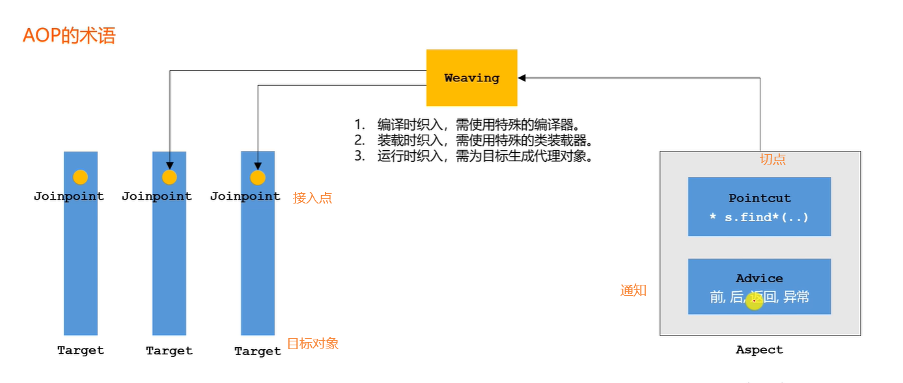 

- 编译时织入：
  - 好处：程序编译的时候，代码已经编织好了，运行时速度快。
  - 但是织入的时机比较早，编译时织入可能很多运行时的条件不知道，可能有些特殊情况还处理的没有那么精细
- 运行时织入
  - 它的好处是，程序已经运行起来了，这个时候所有的运行条件都知道，想织入什么代码都能解决。
  - 缺点是，一边运行，一边还要织入代码，效率是要低的。

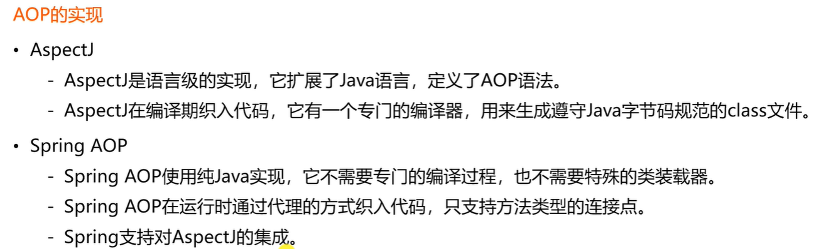 

```java
//spring aop实现的Demo
@Component
@Aspect
public class DemoAspect {
    @Pointcut("execution(* com.zrulin.ftcommunity.service.*.*(..))")
    public void pointcut(){

    }

    @Before("pointcut()")
    public void before(){
        System.out.println("before");
    }

    @After("pointcut()")
    public void after(){
        System.out.println("after");
    }

    @AfterReturning("pointcut()")
    public void afterReturning(){
        System.out.println("afterReturning");
    }

    @AfterThrowing("pointcut()")
    public void afterThrowing(){
        System.out.println("afterThrowing");
    }

    @Around("pointcut()")
    public Object around(ProceedingJoinPoint joinPoint) throws Throwable {//这个参数是连接点
        System.out.println("around  before");
        //Object 是如果目标组件有返回值
        Object obj = joinPoint.proceed();//调目标对象被处理的那个逻辑(就是目标组件的方法)
        System.out.println("around  after");
        return obj;
    }
}
```


统一日志Aop实现：

```java
@Aspect
@Component
public class ServiceLogAspect {

    private static final Logger logger = LoggerFactory.getLogger(ServiceLogAspect.class);

    @Pointcut("execution(* com.zrulin.ftcommunity.service.*.*(..))")
    public void pointcut(){
    }

    @Before("pointcut()")
    public void before(JoinPoint joinPoint){//除了环绕通知以外的通知也可以加这个连接点参数
        // 用户[1,2,3,4] 在 [xxx],访问了[com.zrulin.ftcommunity.service.xxx()]
        // 要记录这样格式的日志，首先用户的ip可以用request获取，在这个里面获取request不能简单的参数里面获取，用一个工具类RequestContextHolder、
        //返回的默认类型是RequestAttributes，这里把他转为子类型ServletRequestAttributes，功能多一点
         ServletRequestAttributes attributes = (ServletRequestAttributes) RequestContextHolder.getRequestAttributes();
         HttpServletRequest request = attributes.getRequest();//获得request对象
         String ip = request.getRemoteHost();//获得用户ip
         String now = new SimpleDateFormat("yyyy-MM-dd HH:mm:ss").format(new Date());
         //获得[com.zrulin.ftcommunity.service.xxx()],前面是。。。后面是获得方法名
         String target = joinPoint.getSignature().getDeclaringTypeName()+"."+joinPoint.getSignature().getName();
         logger.info(String.format("[用户【%s】,在【%s】,访问了【%s】。]",ip,now,target));
    }
```


## 整合redis

- 引入依赖

  - ```xml
            <!-- https://mvnrepository.com/artifact/org.springframework.boot/spring-boot-starter-data-redis -->
            <dependency>
                <groupId>org.springframework.boot</groupId>
                <artifactId>spring-boot-starter-data-redis</artifactId>
            </dependency>
    ```

- 配置redis

  - ```properties
    # redisProperties
    # redis服务器地址
    spring.redis.host=47.97.32.207
    # redis 服务器连接端口
    spring.redis.port=8888
    # redis 数据库索引
    spring.redis.password=dongshan
    # Redis 数据库索引
    spring.redis.database=11
    # 连接超时时间
    spring.redis.timeout=1800000
    # 连接池最大连接数(使用负值表示没有限制)
    spring.redis.lettuce.pool.max-active=20
    # 最大阻塞等待时间(负数表示没有限制)
    spring.redis.lettuce.pool.max-wait=-1
    # 连接池中最大空闲连接
    spring.redis.lettuce.pool.max-idle=5
    # 连接池中最小空闲连接
    spring.redis.lettuce.pool.min-idle=0
    ```

- 编写配置类

  - ```java
    @Configuration
    public class RedisConfig {
    
        //new一个对象（redisTemplate对象）
        //其实Spring boot会自动配置一个redisTemplate对象，但是它的key是Object类型的，我们为了使用String更加方便，重新配置。
    //    参数RedisConnectionFactory，这个bean已经被容器装配了，直接注入进来。
        @Bean
        public RedisTemplate<String,Object> redisTemplate (RedisConnectionFactory factory){
            //设置它的相关的格式
            //实例化这个Bean
            RedisTemplate<String,Object> template = new RedisTemplate<>();
            //设置这个连接工厂，具备访问redis数据库的能力
            template.setConnectionFactory(factory);
    
            //配置主要是配序列化的方式，我们写的程序是Java程序，得到Java类型的数据，最终要把这个数据存到redis数据库中
            //就要指定一种序列化的方式，或者说是数据转化的方式
    
            //设置key的序列化方式
            //RedisSerializer.string()返回一个能够序列化字符串的序列化器
            template.setKeySerializer(RedisSerializer.string());
            //设置value的序列化方式
            template.setValueSerializer(RedisSerializer.json());
            //设置hash的key的序列化方式
            template.setHashKeySerializer(RedisSerializer.string());
            //设置hash的value的序列化方式
            template.setHashValueSerializer(RedisSerializer.json());
    
            //为了让Template中的这些参数生效，要触发一下
            template.afterPropertiesSet();
            return template;
        }
    }
    ```

  ==redis编程式事务管理==

```java
//在开发的时候spring也是支持编程式事务，还有声明式事务，声明式事务更简单，只要做一些配置，加一个注解就可以了。
//声明式事务只能精确到一个方法，方法的内部整个逻辑都是事务的范围，方法之内就没法去查询了，所以通常用编程式事务
//编程式事务
@Test
public  void testTransaction(){
    Object obj = redisTemplate.execute(new SessionCallback() {
        //这个sessionCallback接口里面带了一个execute方法，redisTemplate.execute调用的时候，它底层自己去调的。
        //调的时候它会把这个 operations（执行命令的对象）传过来，用这个对象来执行命令，管理事务。
        //最终这个方法会返回一些数据，返回给这个redisTemplate.execute方法。
        @Override
        public Object execute(RedisOperations operations) throws DataAccessException {
            String key = "test:tx";

            operations.multi();//启动事务
            operations.opsForSet().add(key,"啥也不是");
            operations.opsForSet().add(key,"好像也是");
            operations.opsForSet().add(key,"当然不是");

            //因为在这个里面事务还没有提交，所以查询是没有结果的。
            System.out.println(operations.opsForSet().members(key));

            return operations.exec();//提交事务
        }
    });
    //结果：[1, 1, 1, [好像也是, 当然不是, 啥也不是]]
    // 每一个1表示每一次影响的数据的行数
    System.out.println(obj);
}
```


**注：**

- 关注和点赞都是非常高频的功能，所以把数据存入redis

## redis事务管理

```java
   /**
     * 在实现的时候，有两个维度的操作，一个是点赞，在like:entity:entityType:entityId中加入一个或者取消一个userId（点赞的用户的Id）
     * 同时需要在like:user:userId（被点赞的用户的Id）中加一个点赞的数量或者减少一个点赞的数量
     * 要保证事务性，这两个操作要么全部执行，要么全部不执行，不可被打断。
     *
     * 事务是一个单独的隔离操作：事务中的所有命令都会序列化、按顺序地执行。事务在执行的过程中，不会被其他客户端发送来的命令请求所打断。
     * 事务是一个原子操作：事务中的命令要么全部被执行，要么全部都不执行。
     * @param userId
     * @param entityType
     * @param entityId
     * @param entityUserId  这个是实体所属的用户的id，这个信息从数据库查就降低性能了，所以采取从前端传入参数的方式。
     */
    @Override
    public void like(int userId, int entityType, int entityId ,int entityUserId) {
//        String getLikeKey = RedisKeyUtil.getEntityLikeKey(entityType, entityId);
//        boolean isMember = redisTemplate.opsForSet().isMember(getLikeKey, userId);
//        if(isMember){
//            redisTemplate.opsForSet().remove(getLikeKey, userId);
//        }else{
//            redisTemplate.opsForSet().add(getLikeKey, userId);
//        }
        redisTemplate.execute(new SessionCallback() {
            @Override
            public Object execute(RedisOperations operations) throws DataAccessException {
                String getLikeKey = RedisKeyUtil.getEntityLikeKey(entityType, entityId);
                String userKey = RedisKeyUtil.getUserKey(entityUserId);
                //这个查询操作一定要放到事务之外，如果事务之内不会立即得到结果。
                // 因为他在事务当中执行的所有命令没有立刻执行，而是把这些命令放到了队列里面，
                //当你提交事务的时候统一提交，在执行。

                Boolean isMember = operations.opsForSet().isMember(getLikeKey, userId);
                if(isMember){
                    operations.opsForSet().remove(getLikeKey, userId);
                    operations.opsForValue().decrement(userKey);
                }else{
                    operations.opsForSet().add(getLikeKey,userId);
                    operations.opsForValue().increment(userKey);
                }
                return null;
            }
        });
    }
```

## Redis存储验证码

- 验证码需要频繁的访问和刷新，对性能要求较高

- 验证码不需要永久保存，通常在很短的时间内就会失效。

- 分布式部署时，存在Session共享的问题

  - 把数据部署到redis里面，分布式部署的时候，所有的应用服务器都从redis中取得数据。绕过session，避免session共享问题。

  - 关键代码：

    - ```java
      //生成一个暂时（很快过期）的凭证用于存取验证码（从reids中），存入cookie，让用户持有这个凭证。
      String kaptchaOwner = CommunityUtil.generateUUID();
      Cookie cookie = new Cookie("kaptchaOwner",kaptchaOwner);
      cookie.setMaxAge(60);
      cookie.setPath(contextPath);//有效路径设置为整个路径下都有效
      response.addCookie(cookie);
      //将验证码存入redis
      String kaptchaKey = RedisKeyUtil.getKaptchaKey(kaptchaOwner);
      redisTemplate.opsForValue().set(kaptchaKey,text,60, TimeUnit.SECONDS);
      ```

    - ```java
            //检查验证码
      //        String kaptcha = (String) session.getAttribute("code");
              String kaptcha = null;
              if(!StringUtils.isBlank(kaptchaOwner)){
                  String kaptchaKey = RedisKeyUtil.getKaptchaKey(kaptchaOwner);
                  kaptcha = (String) redisTemplate.opsForValue().get(kaptchaKey);
              }
      ```

## Redis存储登录凭证

- 处理每次请求时，都要查询用户的登录凭证，访问的频率非常高。

  - 关键代码：

    - ```java
       //生成登录凭证,秒换成毫秒所以*1000，date里面存的是过期时间。
              LoginTicket ticket = new LoginTicket(null, user.getId(), CommunityUtil.generateUUID(), 0, new Date(System.currentTimeMillis() + expiredSeconds * 1000));
      //        ticketMapper.insertTicket(ticket);
              //把凭证存入redis
              String ticketKey = RedisKeyUtil.getTicketKey(ticket.getTicket());
              redisTemplate.opsForValue().set(ticketKey,ticket);
      ```

    - 这里的ticket存入redis但是并不设置过期时间，因为这些数据有用，便于以后统计用户登录的时间频率等。

    - ```java
          @Override
          public void logout(String ticket) {
      //        ticketMapper.updateStatus(ticket,1);
              String ticketKey = RedisKeyUtil.getTicketKey(ticket);
              LoginTicket loginTicket = (LoginTicket) redisTemplate.opsForValue().get(ticketKey);
              loginTicket.setStatus(1);
              redisTemplate.opsForValue().set(ticketKey,loginTicket);
          }
      
          @Override
          public LoginTicket findLoginTicket(String ticket) {
      //        return ticketMapper.selectByTicket(ticket);
              String ticketKey = RedisKeyUtil.getTicketKey(ticket);
              return (LoginTicket) redisTemplate.opsForValue().get(ticketKey);
          }
      ```

## Redis缓存用户信息

- 处理每次请求时，都需要根据凭证查询用户信息，访问的频率非常高

  - 关键代码

    - ```java
      /**
       * 通过id获取用户信息
       * @param id
       * @return
       */
      public User findUserById(Integer id);
      
      /**
       * 优先从缓存中取值
       * @param userId
       * @return
       */
      public User getCache(int userId);
      
      /**
       * 取不到时初始化缓存数据
       * @param userId
       * @return
       */
      public User initCache(int userId);
      
      /**
       * 数据变更时清除缓存数据
       * 删除要比更新简单， 更新数据可能会有并发的问题，删除比较干脆
       * @param userId
       */
      public void clearCatch(int userId);
      ```

    - ```java
        @Override
          public User findUserById(Integer id) {
      //        return userMapper.selectById(id);
              User user = getCache(id);
              if(user == null){
                  user = initCache(id);
              }
              return user;
          }
      
          @Override
          public User getCache(int userId) {
              String commonUserKey = RedisKeyUtil.getCommonUserKey(userId);
              return (User) redisTemplate.opsForValue().get(commonUserKey);
          }
      
          @Override
          public User initCache(int userId) {
              User user = userMapper.selectById(userId);
              String commonUserKey = RedisKeyUtil.getCommonUserKey(userId);
              redisTemplate.opsForValue().set(commonUserKey,user,3600,TimeUnit.SECONDS);
              return user;
          }
      
          @Override
          public void clearCatch(int userId) {
              String commonUserKey = RedisKeyUtil.getCommonUserKey(userId);
              redisTemplate.delete(commonUserKey);
          }
      ```

    - ```java
      @Override
      public int updateHeaderUrl(Integer userId, String url) {
          //要把删除缓存放在修改数据库之后，万一更新失败了，但是提前把缓存清除掉了也不太好
          int rows = userMapper.updateHeader(userId,url);
          clearCatch(userId);
          return rows;
      }
      ```


## 发送系统通知

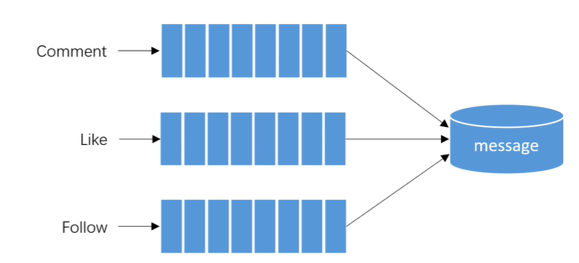 

从技术上的角度来说这是三个主题，利用kafka消息队列，发布消息

从业务上来说，这就是三个事件。

- 触发事件

  - 评论后，发布通知
  - 点赞后，发布通知
  - 关注后，发布通知

- 处理事件

  - 封装事件对象

    - 处理了以下get/set方法，便于封装数据

    - ```java
      public class Event {
          private String topic;
          private Integer userId;
          private Integer entityType;
          private Integer entityId;
          private Integer entityUserId;
          private Map<String, Object> map = new HashMap<>();
      
          public String getTopic() {
              return topic;
          }
      
          public Event setTopic(String topic) {
              this.topic = topic;
              return this;
          }
      
          public Integer getUserId() {
              return userId;
          }
      
          public Event setUserId(Integer userId) {
              this.userId = userId;
              return this;
          }
      
          public Integer getEntityType() {
              return entityType;
          }
      
          public Event setEntityType(Integer entityType) {
              this.entityType = entityType;
              return this;
          }
      
          public Integer getEntityId() {
              return entityId;
          }
      
          public Event setEntityId(Integer entityId) {
              this.entityId = entityId;
              return this;
          }
      
          public Integer getEntityUserId() {
              return entityUserId;
          }
      
          public Event setEntityUserId(Integer entityUserId) {
              this.entityUserId = entityUserId;
              return this;
          }
      
          public Map<String, Object> getMap() {
              return map;
          }
      
          public Event setMap(String key, Object value) {
              this.map.put(key,value);
              return this;
          }
      }
      ```

  - 开发事件的生产者

    - ```java
      @Component
      public class EventProduce {
      
          @Autowired
          private KafkaTemplate kafkaTemplate;
      
          public void fireEvent(Event event){
              kafkaTemplate.send(event.getTopic(), JSONObject.toJSONString(event));
          }
      }
      ```

  - 开发事件的消费者

    - ```java
      @Component
      public class EventConsumer implements CommunityConstant {
      
          private static final Logger logger = LoggerFactory.getLogger(EventConsumer.class);
      
          @Autowired
          private MessageService messageService;
      
          @KafkaListener(topics = {TOPIC_Like,TOPIC_COMMENT,TOPIC_FOLLOW})
          public void handelCommentMessage(ConsumerRecord record){
              if(record == null || record.value() == null){
                  logger.error("订阅的消息内容为空");
                  return;
              }
              Event event = JSONObject.parseObject(record.value().toString(), Event.class);
              if(event == null){
                  logger.error("订阅的消息格式错误！");
                  return;
              }
      
              //发送站内通知,构造message对象，复用表。
              Message message = new Message();
              message.setFromId(SYSTEM_USER_ID);
              message.setToId(event.getUserId());
              message.setConversationId(event.getTopic());
              message.setStatus(0);
              message.setCreateTime(new Date());
      
              Map<String, Object> content = new HashMap<>();
              content.put("userId",event.getUserId());
              content.put("entityType",event.getEntityType());
              content.put("entityId",event.getEntityId());
      
              if(!event.getMap().isEmpty()){
                  for(Map.Entry<String, Object> map : event.getMap().entrySet()){
                      content.put(map.getKey(),map.getValue());
                  }
              }
              message.setContent(JSONObject.toJSONString(content));
              messageService.addMessage(message);
          }
      }
      ```

每次有事件触发的时候，就会触发event。

封装一个相应的系统通知对象到数据库。一个订阅这些事件的消费者自动进行封装。触发事件的线程可以去做自己的事情，不用管了。

